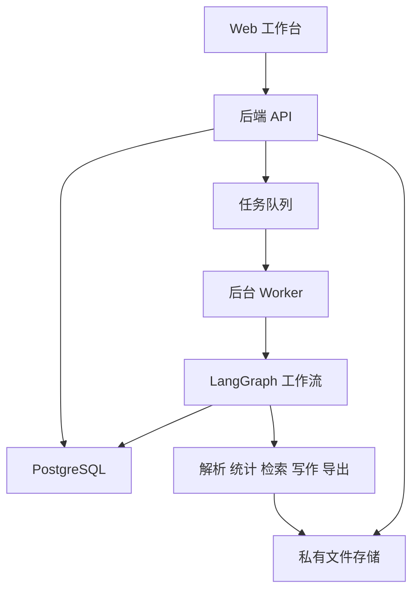

# PaperAssist System 技术实现方案 V0.1

| 项目 | 内容 |
| --- | --- |
| 工程名称 | `paperassist-system`，用于仓库与文件夹命名，不代表最终产品名称 |
| 文档版本 | V0.1 |
| 编写日期 | 2026年9月28日 |
| 需求依据 | 《科研论文辅助Agent项目需求文档_V0.13.docx》 |
| 选型参考 | 《项目参考文档.md》及本文末尾官方资料 |
| 当前状态 | 技术设计初稿，尚未开展集成验证或性能测试 |
| 适用范围 | 第一阶段 PC Web 产品及其分步开发过程 |

本方案用于把已确定的产品需求转化为可执行的开发安排。推荐采用一个代码仓库、按功能划分模块的架构，以 Python 后端承载分析和写作流程，以 Web 前端承载项目、任务和成果管理。先完成 Excel 数据到 Word 分析报告的完整流程，再逐步加入文献核验、SCI 写作、毕业论文模板、意见处理与商业运营能力。

本文区分三类内容：**已确定需求**来自 V0.13；**推荐方案**是本次提出的实现选择，可在验证后调整；**待验证事项**需要原型、样本或产品决策才能定案。本文不修改原需求，不代表所有选型已获最终确认，也不代表相关开源项目已完成集成。

## 1 产品目标与开发边界

### 1.1 产品说明

本项目面向生物医学、药学科研场景，基于用户自己的研究数据与资料，完成统计分析、图表生成、文献检索与引用核验，辅助生成 SCI 原创研究论文或符合学校模板的毕业论文初稿。系统支持根据审稿、导师及评审意见进行多轮修改，保存稿件版本，并提供 Word/PDF 导出。

### 1.2 已确定的第一阶段范围

- PC Web 端，支持中文、英文界面和任务内容。
- 普通用户、管理员两类角色。
- 项目创建时选择 SCI 科研论文项目或毕业论文项目。
- 两类项目共用数据分析、文件解析、文献检索与引用能力。
- SCI 初稿包含七部分，并支持期刊建议和审稿修改。
- 毕业论文按学校模板组织内容，并支持导师及评审修改。
- 图表与统计结果、解释、图注保持关联。
- 论文、报告及修改材料支持 Word/PDF 下载。
- 任务支持等待资料、等待确认、失败处理和历史记录。
- AI 能力主要接入 OpenAI 官方 API；检索通过 NCBI E-utilities 接入 PubMed。

### 1.3 开发里程碑不等于删减产品需求

第一个可运行里程碑只实现 Excel 分析与 Word 报告，用于验证基础链路。PDF、复杂文件解析、SCI 写作、毕业论文、多轮修改等仍属于完整第一阶段范围，按后续里程碑完成。

不把移动端、团队协作、任意图表编辑、全学科检索或任意学校模板兼容列入本次已承诺范围。原需求未确定的统计方法、容量上限、模板精度与收费方式，应在开发过程中明确。

## 2 技术决策摘要

| 决策 | V0.1 推荐 | 选择原因与调整条件 |
| --- | --- | --- |
| 仓库组织 | 单仓库，前后端目录分开 | 一处管理代码、文档和接口契约，便于小团队开发 |
| 系统形态 | 模块化后端 + 独立后台 Worker | 长任务与网页请求分开，初期无需将每个模块拆成微服务 |
| 前端 | React + TypeScript + Vite | 适合以登录后的项目工作台为核心的 Web 应用 |
| 后端 | Python + FastAPI + Pydantic | 直接衔接统计、文献和 Word 处理生态 |
| 数据库 | PostgreSQL + SQLAlchemy + Alembic | 保存项目、任务、引用和版本关系，管理数据库变更 |
| 工作流 | LangGraph | 表达有状态的步骤、等待和恢复；业务规则由本项目实现 |
| 后台任务 | Celery + RabbitMQ | Celery 负责调度执行，RabbitMQ 传递任务消息 |
| 文件存储 | 开发期本地存储适配器；上线采用私有对象存储 | 统一接口，避免把文件路径直接写进业务逻辑 |
| 统计执行 | 首先使用经过审核的固定工具函数 | 模型提交结构化方法和参数，不在首个版本自由执行生成代码 |
| 文献检索 | Bio.Entrez + PubMed | 与 V0.13 一致 |
| 引用核验 | 自研关联与核验流程，PaperQA 为候选组件 | 先验证摘要核验；复杂证据检索再评估 PaperQA |
| Word/PDF | python-docx + 必要的 OpenXML；LibreOffice 为 PDF 转换候选 | 内容生成与版面渲染分开，学校模板需要样本验证 |
| 模型接入 | 官方 SDK，经项目自有适配层调用 | 模型名称、参数、预算通过配置管理 |

以上为起步组合，不要求在第一天安装所有组件。第 15 节按里程碑规定引入顺序。

### 2.1 暂不固定具体软件版本

创建工程时选用相互兼容、仍受支持的稳定版本，生成 Python 和前端依赖锁文件，并记录 Python、Node.js 与系统镜像版本。V0.1 不根据记忆指定“最新版本”，也不承诺未经安装验证的版本组合。

模型具体 ID、云厂商、对象存储供应商、支付渠道与在线编辑器暂不锁定。它们不阻塞第一个本地流程的开发，但相关接入必须在对应功能上线前完成验证。

## 3 系统结构与职责

图中展示职责与主要调用关系，不代表每个框都必须部署为独立服务。模型和 PubMed 等外部接口通过工具适配层访问。

### 3.1 前端

提供项目中心、文件上传、数据预览、任务创建、执行进度、待补充事项、图表与报告查看、稿件版本、意见处理和下载页面。管理员页面提供配置、异常任务和费用统计。

第一版稿件交互优先采用章节预览、补充要求、指定章节重写、下载 Word 和重新上传修改稿。是否开发复杂的浏览器富文本编辑器另行决定，不把它当作首个流程的前置条件。

### 3.2 后端 API

处理身份认证、资源权限、项目管理、文件登记、任务请求、查询、确认和下载。长任务返回任务标识后转交 Worker，不占用一个 HTTP 请求等待整篇论文完成。

### 3.3 后台 Worker 与工作流

Worker 领取任务并运行工作流。LangGraph 管理步骤之间的输入输出和检查点；任务服务管理排队、重试、取消、租约和业务状态。PostgreSQL 中的业务记录是用户看到的任务状态依据。

Celery、LangGraph 和数据库承担不同职责，不能各自维护互相矛盾的“最终状态”。Celery 的内部结果状态不直接成为业务接口；主要成果和错误统一写入业务任务记录。

### 3.4 外部能力适配层

定义模型、文件存储、PubMed、文档解析、统计执行和导出接口。开源项目通过这些接口接入，业务模块不直接散落依赖某个第三方项目的内部实现。

例如，写作模块接收已核实的文献证据对象，不直接调用 PaperQA 私有方法；更换证据实现时，不需要重写全部论文流程。

## 4 开源组件的具体使用方式

| 组件 | 接入方式 | 复用内容 | 本项目仍需实现 |
| --- | --- | --- | --- |
| LangGraph | 直接依赖 | 工作流、检查点、等待与恢复机制 | 节点、业务状态映射、幂等与任务管理 |
| Data Formulator | 源码研究，按需局部二开 | 数据理解、分析交互和可视化组织 | 生物医学统计规则、项目隔离、统一结果格式 |
| Docling | 解析适配器中的候选依赖 | 文档内容和结构提取 | 文件分流、来源定位、质量判断与人工确认 |
| PaperQA | 单独做接入验证后决定 | 证据提取与检索辅助 | PubMed 优先策略、核验状态、论述引用关联 |
| data-to-paper | 工作流参考或少量代码复用 | 分析到写作的追溯思路 | SCI 七部分流程和产品级版本体系 |
| Bio.Entrez | 直接依赖 | ESearch、EFetch 等接口封装 | 限流协调、检索记录、去重和错误处理 |
| python-docx | 直接依赖 | DOCX 内容生成和修改 | 报告模板、学校格式与引用编号 |
| docxcompose | 有拼接需要时引入 | DOCX 合并 | 分节、页眉页脚和样式验证 |
| GPT Researcher / STORM | 暂以思路参考为主 | 问题分解和提纲组织 | 研究事实、可靠引用与具体写作规则 |

不建议第一版把上述完整应用全部作为依赖装入系统。先明确本项目的输入输出契约，再决定哪些实现值得引入。

AI-Scientist-v2 不进入源码方案；PandasAI 整仓库不进入第一版。原因和许可边界见《项目参考文档.md》，不将“本项目不采用”写成“所有商业使用均被禁止”。

## 5 核心数据设计

### 5.1 数据存放原则

关系、状态和小型结构化记录放 PostgreSQL；原始文件、图表、DOCX、PDF 以及较大的解析结果放文件存储。数据库记录对象标识、校验值和所属项目，不保存可长期公开访问的下载链接。

分析结果、图表和稿件采用不可变版本：生成新结果时新增版本，不覆盖旧产物。项目可以有“当前版本”指针，但任务始终绑定明确输入版本。

### 5.2 建议的逻辑实体

以下为逻辑设计，可按里程碑创建对应表，不要求首个版本一次建完。

| 实体 | 关键内容 | 重要关联 |
| --- | --- | --- |
| User / Session | 用户、角色、会话与失效时间 | 会话属于用户 |
| Project | 名称、类型、主题、所有者、默认语言 | 类型为 `sci` 或 `thesis` |
| FileAsset | 文件类型、对象标识、大小、哈希、解析状态 | 属于项目，记录上传者 |
| ParsedDocument | 文本、表格、图片位置、解析质量 | 指向原始 FileAsset 和解析器版本 |
| DatasetVersion | 字段、类型、单位、清洗记录、数据文件 | 指向来源文件和父版本 |
| AnalysisPlan | 研究问题、方法、参数、缺失值处理、确认记录 | 固定所用 DatasetVersion |
| AnalysisRun | 实际参数、工具版本、样本量、统计量、执行状态 | 指向 AnalysisPlan 与数据版本 |
| FigureArtifact | 图片、图注、绘图配置、语言、结果来源 | 指向 AnalysisRun |
| ReferenceRecord | PMID、DOI、题名、作者、期刊、年份、链接 | 按来源标识去重 |
| ProjectReference | 项目内选用记录、获取范围和处理状态 | 连接项目与 ReferenceRecord |
| EvidenceRecord | 论述、支持理由、来源位置、读取范围、核验状态 | 指向 ProjectReference |
| ManuscriptVersion | 父版本、语言、结构、章节内容、输入清单 | 指向项目、结果和模板版本 |
| CitationBinding | 章节与段落标识、所支持论述、文献标识 | 属于特定稿件版本 |
| TemplateVersion | 学校信息、来源文件、结构和样式规则 | 每个稿件固定使用一个版本 |
| ReviewRound / ReviewItem | 输入稿、意见来源、逐条编号、处理状态 | 每轮对应指定稿件版本 |
| JournalProfile | 期刊来源、字段值、核实时间、作者指南版本 | 推荐结果绑定本次采用的信息快照 |
| Task / TaskAttempt | 类型、输入快照、状态、重试、检查点、错误 | 每次执行保留独立记录 |
| TaskEvent | 事件序号、阶段、摘要、时间 | 支持进度展示和恢复查询 |
| ExportArtifact | 稿件或报告版本、格式、文件、渲染版本 | 下载始终对应固定版本 |
| UsageEvent | 模型、请求、用量、计价版本、估算成本 | 指向用户、项目、任务与执行次数 |

涉及权限的关联必须核对项目归属，不能只根据一个可猜测的 ID 查询数据。公共书目元数据可统一去重；用户上传全文、证据记录和写作内容保持项目权限隔离。

### 5.3 统一结果契约

分析工具至少输出：`schema_version`、数据版本、方法和参数、有效样本量、排除数量、统计量、效应量、置信区间、P 值（适用时）、单位、诊断信息与警告。不存在的指标使用空值并说明原因，不生成看似合理的数值。

写作模块只使用已通过校验的结果对象。对关键数值采用明确字段引用或受控占位符，导出前核对数值、舍入规则和单位；不能仅依赖另一个模型“读一遍检查”。

图片识别得到的数值与原始表格计算结果分开标记。只有图像而无原始数据时，可以整理已知结果，不能据此推断未提供的样本量或统计显著性。

### 5.4 版本与追溯

一次任务记录输入文件哈希、数据版本、模板版本、提示词版本、模型配置、统计工具版本和运行环境标识。可复现统计结果与保留生成过程，不等同于保证大模型每次产生逐字相同的文本。

修改稿保留 `parent_version_id`。用户重新上传的 Word 作为新输入快照保存，不自动覆盖系统原稿；自动提取结构后，需要对章节匹配和重要差异进行核对。

## 6 科研数据分析流程

### 6.1 文件接入与解析

| 类型 | 推荐处理路径 | 需要保留与检查的内容 |
| --- | --- | --- |
| Excel `.xlsx` | openpyxl 读取单元格结构，pandas 整理分析表 | 工作表、原始值、类型、单位、合并单元格和公式 |
| Word `.docx` | python-docx 或 Docling 适配器 | 正文、表格、图表及位置；学校模板保留原始样式结构 |
| PDF | Docling 候选流程，按需 OCR | 页码、文字、表格结构、图像及不确定项 |
| 图片 | 视觉理解或 OCR 辅助 | 图中文字、标签、单位与识别可信程度 |

首个里程碑只承诺 `.xlsx`。旧式 `.xls`、带宏文件、加密文件和复杂扫描件分别定义支持策略；不因界面写着“Excel/Word/PDF”就默认支持所有子格式。默认不执行宏。

openpyxl 不负责执行 Excel 公式计算。若分析字段依赖公式，应识别是否存在有效缓存值；不能把缺失或过期缓存当成可靠原始结果。提示用户提供已重新计算的文件或数值副本，另保留来源说明。

### 6.2 分析计划

先生成字段概况和数据质量报告，再由模型输出结构化 AnalysisPlan，包括研究问题、变量、分组、方法、方法适用条件、清洗策略和预期图表。

V0.1 推荐默认让用户确认分析计划；简单任务是否允许直接执行，保留为可配置产品选择。研究设计不清、重复测量无法识别、单位不一致或关键字段缺失时，进入待补充状态。

### 6.3 首批工具能力

| 批次 | 建议支持 | 前提 |
| --- | --- | --- |
| 首个流程 | 数据概况、缺失值统计、描述统计、按组箱线图 | 明确字段、单位、分组；不自动填补或删除异常值 |
| 基础统计扩展 | Pearson/Spearman 相关、明确设计下的组间比较 | 明确方法适用条件、配对或独立关系、缺失处理 |
| 模型与生物医学图表扩展 | 回归、ROC/AUC、Kaplan–Meier、森林图 | 为每个方法定义输入契约与验证样本，分别上线 |

SciPy 用于基础统计，statsmodels 用于适用的回归和统计建模，lifelines 用于生存分析，scikit-learn 用于 ROC/AUC 等评估；绘图以 Matplotlib 为主。具体方法列表需在对应里程碑前确认。

ROC 应明确结局编码与预测分数来源；生存分析应明确时间、事件与删失编码；森林图应明确效应量和置信区间的计算来源。多重比较、缺失值处理和数据泄漏等问题不能交由通用绘图库自动解决。

### 6.4 执行与隔离

第一个版本使用允许调用的方法注册表，例如描述统计、指定相关性和固定绘图函数。模型只能选择工具及填写参数，不能直接提交任意 shell 或 Python 程序。

统计执行仍放在独立进程或受限容器中，使用只读输入、独立输出目录、超时、内存与 CPU 限制；默认不访问网络，也不持有数据库和模型密钥。执行入口由受信服务控制，不向模型或普通 Worker 暴露宿主机管理接口。

未来若增加模型生成代码，作为单独能力设计更强隔离、依赖白名单和结果验证后再启用；普通容器不能被表述为绝对安全的任意代码沙箱。

### 6.5 图表与报告

输出 PNG 作为 Word 嵌图，保留绘图配置和可复现的结果数据；确有需要时增加 SVG 等格式。图号、标题、坐标轴、单位、分组、图例、统计标记和图注按图型生成，中文字体随运行环境验证。

报告包括数据概况、质量问题、处理方法、统计结果、图表与解释、局限和待确认项。每个图表对象绑定其结果来源，传入论文后保留图注。改变语言时同步处理图中文字和正文，文献原题名等按引用规范保留。

## 7 文献检索与引用核验

### 7.1 检索与获取

模型从当前章节或审稿意见提炼检索主题，生成英文术语、同义词和适用的 MeSH 检索式。后端调用 ESearch 获取 PMID，再调用 EFetch 获取书目信息与可用摘要，记录检索式、条件、时间和来源。

Bio.Entrez 封装接口调用；本项目负责多 Worker 的总体限流、缓存、退避重试和调用身份配置。接口未返回的 DOI、摘要或年份不允许由模型补造。

### 7.2 证据与引用关系

每条候选论述形成证据记录，记录实际读取范围为摘要、全文或用户资料，并使用以下状态：

| 状态 | 含义 | 写作处理 |
| --- | --- | --- |
| supported | 当前读取内容足以支持限定后的论述 | 允许引用，保留核查入口 |
| partial | 只支持部分范围或附带条件 | 收窄论述或补充证据 |
| unsupported | 内容不支持该论述 | 不用于支持该句 |
| needs_review | 材料不足、冲突或无法确定 | 标记待核实 |

“supported”代表本次流程的核验结果，不是对文献科学有效性的绝对保证。文献确实存在、DOI 可解析、内容支持论述，是不同的检查项。

只有摘要时，不生成摘要中没有的具体数据、方法细节或亚组结论；需要全文而无法获得时，提示用户补充材料或调整表述。

### 7.3 引用输出

写作时使用稳定的内部文献 ID 和 CitationBinding，导出时按首次出现顺序或指定格式生成编号与参考文献列表。添加或删除段落后统一重排，避免让模型手工维护整篇编号。

第一种引用格式应在文献里程碑前确定并形成测试样例；后续通过格式适配器支持其他期刊和学校要求。V0.1 不承诺任意引用格式兼容，也暂不指定尚未评估许可的引用样式引擎。

### 7.4 保存范围

保存书目信息、来源链接、项目引用关系、核验记录与必要定位信息。摘要和全文按任务需要及来源条件获取、处理和保留，不默认建设面向用户共享的全文下载库。

正常概括研究发现并标注参考文献，通常不需要仅因引用而逐篇购买版权。全文复制、图表复用、自动化内容处理和对外传播涉及各自的使用条件；不能把“产品收费”直接等同于“销售被引用的论文”。

## 8 SCI 与毕业论文写作

### 8.1 共用写作引擎

两类项目共用资料整理、文献核验、章节写作、数值检查、版本保存和导出能力。通过项目类型、章节规则和模板配置选择不同流程，无需复制两套后端。

资料理解先建立研究问题、研究设计、方法、数据、图表和外部文献的关系。缺少真实实验步骤、样本量或审批资料时标记待补充，不能依据常见论文写法自动填入。

### 8.2 SCI 生成顺序

1. 整理用户资料、真实分析结果和图表。
2. 按研究问题组织 Results 小节及图表分组。
3. 生成 Results 和 Materials and methods。
4. 检索核实文献，生成 Introduction 和 Discussion。
5. 提炼 Title、Abstract，整理 References。
6. 检查数值、单位、术语、图号、图注、引用和缺失项，创建稿件版本。

最终显示和导出的默认顺序遵循 V0.13：Title、Abstract、Introduction、Results、Discussion、Materials and methods、References。生成顺序与导出顺序可以不同。

### 8.3 毕业论文模板

把学校模板整理为 TemplateSchema：页面与分节、封面字段、章节顺序、标题层级、正文样式、中英文摘要、目录、图题表题、参考文献规则及特殊要求。

模板中的原始样式信息通过 DOCX/OpenXML 读取；不能只把模板转换成 Markdown 后宣称保留排版。模型辅助理解文字规范，程序读取可确定的样式属性，两者冲突时形成待确认项。

先支持少量明确验证过的学校模板。上传一个未知模板时展示解析结果和不支持项，不能承诺任意模板自动完全还原。正文内容与格式规则分开存储，便于修改内容后重新导出。

### 8.4 稿件编辑与一致性

章节正文与引用、图表关联分别存储，段落保留稳定标识。章节重写生成新版本，不就地替换历史稿件。

分析结果发生变化后，把引用该结果的 Results、Abstract、Discussion 和图注标记为需要更新。只更新受影响章节，再运行全稿的一致性检查。禁止把旧 P 值、样本量或结论沿用到新版本而不提示。

## 9 审稿与评审修改

输入必须绑定稿件版本、意见轮次和原始意见。系统拆分意见并编号，区分表达、结构、文献、统计、图表、方法、格式和新增实验等类别。

每条意见记录：原文、来源、涉及位置、处理计划、状态、修改内容、相关任务、用户决定和回复说明。可用状态包括待处理、待确认、待补充、执行中、已完成与未采纳；未采纳时保留理由。

需要重新分析时创建关联分析任务，取得实际结果后再更新论文。需要补充实验或数据时等待用户，不把尚未完成的事项写成已完成。

每轮产出修改稿、逐条修改说明；SCI 审稿另生成逐条回复草稿。通过章节标题、段落标识、图表编号提供定位；页码和行号只有在最终渲染后才能填写，不能预先猜测。原生 Word 修订痕迹是否支持另行验证，第一版先保证独立修改对照表可用。

## 10 期刊建议

先实现研究主题、文章类型、收稿范围、相关内容、已核实费用和作者指南的匹配，输出期刊名称、理由、来源、核实日期和待确认项。

开放书目数据与期刊官网是候选来源。SCI/SCIE、JIF、JCR 或其他分区必须绑定准确来源、年份和评价体系，不能根据 PubMed 是否检索得到来推断。

JIF/JCR 接入是独立的数据服务选择；未取得适用许可时不显示未经授权或未经核实的指标，仍可提供其他匹配信息。第一版是否接入付费指标不阻塞数据分析和论文引用功能。

用户确认目标期刊后，保存作者指南版本并形成格式检查项；自动获取网页应使用受控访问工具，限制地址、重定向和内部网络访问。

## 11 任务状态与恢复

### 11.1 分开记录状态与当前阶段

| 字段 | 建议取值 | 用户界面的含义 |
| --- | --- | --- |
| status | queued | 待执行 |
| status | running | 正在执行 |
| status | waiting_input | 待补充资料 |
| status | waiting_confirmation | 待用户确认 |
| status | succeeded / failed | 已完成 / 执行失败 |
| status | cancelling / cancelled | 取消中 / 已取消，作为建议补充能力 |
| phase | parse / plan / compute / search / write / export / verify | 文件解析、AI 分析、计算、检索、写作、导出或检查 |

这样可以表达 V0.13 的任务状态，又不需要把每一个阶段都当成独立终态。投稿、返修、录用或评审通过属于项目业务进展，不与任务成功状态混用。

### 11.2 检查点与等待

LangGraph 使用持久化检查点，图状态以各产物 ID 和必要上下文为主，不塞入整份大文件。线程和检查点与 Task、输入快照、工作流版本绑定。

等待用户时保存检查点并释放 Worker；用户提交资料或确认后，再排队恢复。恢复前核验权限、当前状态和输入版本，防止重复点击恢复两次。

### 11.3 消息可靠性与幂等

任务创建与待发送消息在同一数据库事务中写入，使用 outbox 转发到队列，避免“数据库里有任务但消息未发出”的间隙。队列消息只携带任务 ID 等小型标识。

按至少一次投递设计。Worker 领取任务时获取租约，执行副作用前使用幂等键和唯一约束；重复消息不能生成重复稿件或重复扣费。任务事件、产物和检查点需要可核对，定期恢复过期租约和遗漏状态。

外部模型调用不保证由本系统实现严格的恰好一次执行。调用成功但响应遗失时标记结果未知，按节点策略处理，不无限自动重试。记录请求标识，区分供应商实际消耗与用户收费账目。

网络错误和限流可按次数退避重试；数据不合格、资料缺失、预算不足或方法不支持不能靠自动重试解决。任务取消在节点边界检查，运行中的受控统计进程可以终止；已发生的外部 API 消耗不自动消失。

### 11.4 进度展示

首先采用轮询任务详情与增量事件，实现简单稳定的进度展示；确有体验需要时增加 SSE。展示已完成步骤、当前阶段和待办内容，不用虚构百分比掩盖耗时不可预测的阶段。

## 12 API 与接口契约

使用 `/api/v1` 前缀，JSON 请求与响应由 Pydantic 定义，FastAPI 输出 OpenAPI 说明。文件上传使用对应二进制上传接口；客户端不指定存储绝对路径。

| 接口示意 | 用途 |
| --- | --- |
| `POST /api/v1/projects` | 创建项目，指定 `sci` 或 `thesis` |
| `GET /api/v1/projects` | 查询当前用户项目 |
| `POST /api/v1/projects/{id}/files` | 上传并登记资料 |
| `GET /api/v1/projects/{id}/datasets` | 查看解析得到的数据版本 |
| `POST /api/v1/projects/{id}/tasks` | 创建分析、检索、写作、导出或修改任务 |
| `GET /api/v1/tasks/{id}` | 查询任务状态、阶段和产物 |
| `GET /api/v1/tasks/{id}/events` | 按事件游标查询增量进度 |
| `POST /api/v1/tasks/{id}/resume` | 提交补充资料或确认后恢复 |
| `POST /api/v1/tasks/{id}/cancel` | 请求取消 |
| `GET /api/v1/projects/{id}/manuscripts` | 查询稿件版本 |
| `POST /api/v1/projects/{id}/review-rounds` | 创建意见轮次，绑定输入稿 |
| `POST /api/v1/projects/{id}/exports` | 创建指定版本的导出任务 |
| `GET /api/v1/artifacts/{id}/download` | 校验权限后提供下载 |

创建任务采用明确的类型和输入结构，响应返回 `202` 与任务 ID。每个类型分别校验字段，不使用一个任意字典容纳全部参数。

创建请求支持幂等键，更新或恢复携带期望版本。统一错误结构包含 `code`、`message`、`request_id` 和可公开的详情；日志保留内部诊断，用户响应不泄露密钥、堆栈路径和其他项目数据。

## 13 模型调用与成本控制

### 13.1 统一模型适配层

通过 OpenAI 官方 SDK 调用，Responses API 作为新实现的候选主接口。模型、超时、输出上限、可用工具和提示词版本统一配置，业务代码不硬编码某个模型名称。

分析计划、检索方案、章节提纲和意见拆分使用结构化输出；实际计算、检索和导出通过受控工具调用。符合 JSON Schema 只说明结构有效，后端仍需验证权限、方法前提、字段范围和事实支持。

本次未评测具体模型，因此不在方案中承诺某个模型的质量、价格或账号可用性。先以同一批任务样例比较成功率、事实错误、延迟与成本，再决定不同节点是否使用不同模型。

### 13.2 上下文与输入管理

统计以完整数据在工具内计算；模型通常接收数据概况、必要字段样例、已核验结果和当前章节所需证据。不要把整份大表和全文历史在每次调用时重复发送。

文件、网页和论文中的文本属于待处理资料，不能作为系统指令。模型工具权限由服务端决定，不允许文献内容引导其读取其他项目、导出密钥或绕过分析规则。

### 13.3 成本记录与预算

每次调用记录模型 ID、提供方用量、任务与节点、重试次数、价格配置版本、估算成本和请求标识。提供方未返回用量时标记待核对，不把未知记为零。

设置用户、项目和单任务预算，调用前检查额度，达到限制时暂停并给出已生成成果。额度判断和预留需要事务保证；实际消耗、内部成本、用户收费和退款分别记账。

开发期先实现用量记录与预算上限，付费发布前再完成套餐或余额账本、支付确认和退款规则。支付渠道、定价及失败任务是否收费属于待定产品决策。

## 14 导出 隐私与部署

### 14.1 Word 和 PDF

文档内容来自固定稿件或报告版本，导出时解析图表及引用关联，应用模板，生成可编辑 DOCX。PDF 使用独立渲染进程，LibreOffice 无界面转换为候选方案。

PDF 转换隔离用户配置目录，避免并发冲突；设置超时，禁用宏与不必要网络访问。固定字体包和渲染版本，验证中文、公式、分页、分节、目录与交叉引用。

python-docx 不直接负责 PDF 渲染。DOCX 已完成但 PDF 转换失败时保留成功的 DOCX，并分别显示两个导出状态；没有通过格式检查的文件不能被笼统标记为全部成功。

### 14.2 认证与权限

推荐采用服务端可撤销会话与安全 Cookie。具体登录方式在面向用户发布前确定；若使用邮箱密码，使用成熟密码哈希组件并实现登录限流、会话失效和找回流程。

所有项目、任务、文件、稿件和下载接口都检查归属。管理员运营权限与读取用户研究内容的权限分开，内容访问应有必要范围和审计记录。未实现认证的原型只允许本机使用，不直接开放公网。

### 14.3 文件与研究数据

上传检查大小、扩展名、实际文件类型和解析资源消耗。解析与模型上下文分离；身份标识等不必要字段应在发送外部模型前移除或替换。

日志默认记录标识、状态和错误摘要，不记录整份研究数据或全文。密钥保存在部署环境的秘密配置中，不能放进前端、仓库、提示词或 `.env.example`。

保留策略需明确覆盖原始文件、派生数据、图表、稿件、检查点、模型调用记录与备份。用户删除项目后按约定流程处理主存储与备份生命周期，不能只删项目列表中的一行。具体保留天数在对外使用前确定。

### 14.4 开发与上线环境

本地使用 Git、受支持的 Python/Node.js、隔离依赖和 PostgreSQL。后台任务里程碑引入 RabbitMQ 与 Worker；以容器编排配置统一服务启动，Windows 开发可使用 WSL2 中的 Linux 环境。

生产初期可采用单台 Linux 应用主机加数据库和私有对象存储的简单部署；具体容量由实测决定。API、Worker 和统计/渲染执行进程分开配置资源，数据库与消息端口不直接暴露公网。

上线必须验证 HTTPS、备份恢复、数据库迁移、任务中断恢复与错误追踪。备份既包含数据库，也包含对应文件对象；目标恢复时间、可接受数据丢失窗口和扩容门槛在试运行后设定。

容器开发工具、云服务和预装组件各有自己的许可或服务条款，不因本项目代码开放就自动全部免费。具体部署供应商在预算和地区要求明确后选择。

## 15 开发里程碑与验收

### M0 工程准备

**工作内容：**将 GitHub 仓库克隆到本地，统一在该目录开发；加入需求、参考和本文，建立前后端骨架、配置示例、依赖锁文件、数据库迁移和最小自动检查。

**验收：**从一次干净克隆按 README 可以启动前后端、连通数据库；示例环境文件无密钥；基础 API 可访问；文档、锁文件和代码均在版本管理中。

### M1 Excel 到 Word 分析报告

**工作内容：**项目创建、上传一份 `.xlsx`、预览字段与缺失值、模型整理分析计划、用户确认、运行描述统计与固定箱线图工具、保存结构化结果、生成 Word 报告。

M1 可使用本地独立 Worker 执行任务，业务仍按异步任务接口设计。只运行在本机；完整队列恢复和多用户访问在 M2 完成。

**验收：**一份脱敏样例从网页上传到报告下载完整跑通；统计数值与独立核算一致；图表有标签和图注；错误字段或无效数据能明确反馈；重复下载对应同一结果版本。报告不编造缺失的研究信息。

### M2 任务可靠性与多用户基础

**工作内容：**接入 Celery/RabbitMQ、LangGraph 持久化、outbox、幂等、等待与恢复、认证、项目权限、成本记录和私有文件访问。

**验收：**关闭页面不停止任务；重启 Worker 后可恢复；待确认任务不持续占用 Worker；重复投递不重复生成成果；两个测试用户无法读取对方项目；任务预算能够阻止继续调用。

### M3 文献检索与引用

**工作内容：**PubMed 检索、候选记录、摘要核验、论述关联、一个已确定的引用格式；用样例比较是否引入 PaperQA。

**验收：**每条引用可打开实际来源；正文和文末列表对应且无孤立编号；只有摘要的任务不生成全文细节；“文献存在但不支持论述”的负例能被标记；限流、缺失字段和获取失败得到正确处理。

### M4 SCI 初稿与 PDF

**工作内容：**七部分内容生成、结果分组、方法与文献衔接、一致性检查、稿件版本、DOCX/PDF；逐步支持 Word/PDF/图片资料输入。

**验收：**初稿结构符合 V0.13；研究数值可追溯；文献发现与用户结果清楚区分；中英文图文一致；DOCX 可编辑；PDF 无缺图、明显裁切或错乱；待补充项清晰可见。

### M5 毕业论文与统计能力扩展

**工作内容：**接入一至两套真实学校模板，支持结构与样式规则、模板版本和冲突提示；按已确定方法范围扩展 ROC、KM、森林图等能力。

**验收：**样例模板的封面、章节、目录、正文、图表、参考文献和分页逐项检查；未知模板限制明确；每项新增统计方法有独立验证数据及失败输入样例。

### M6 多轮修改与期刊建议

**工作内容：**审稿和导师意见拆分、逐条计划、重新分析、相关章节更新、回复与对照说明、期刊匹配和目标期刊格式检查。

**验收：**每条意见有处理状态及去向；未做实验不被写为已完成；修改使用正确稿件版本；原稿保留；期刊字段有来源、日期和未核实标记，任务完成不自动变成录用或评审通过。

### M7 付费发布准备

**工作内容：**管理员后台、配额与收费账本、支付接入、文件保留与删除、备份恢复、依赖许可记录、运行监测和容量验证。

**验收：**收费、失败重试、取消和退款规则经过样例验证；备份可恢复到一致的任务与文件状态；用户隔离及下载权限有效；关键错误可追踪；发布文档明确支持范围与已知限制。

里程碑按依赖推进，不在本方案中虚构工期。M1 是技术验证结果，M7 才是完整付费发布准备的检查点。

## 16 验证方法与质量标准

| 类型 | 验证重点 | 方法 |
| --- | --- | --- |
| 统计正确性 | 样本、方法、参数、数值与单位 | 使用有独立期望结果的数据集，与可信实现或人工核算对照 |
| 数据解析 | 表头、单位、缺失、合并单元格、公式缓存 | 保存真实边界样例，检查失败时不会静默改值 |
| 引用准确性 | 支持关系与读取范围 | 人工标注支持、部分支持、不支持和材料不足样例 |
| 稿件一致性 | 跨章节数值、图号与引用 | 程序检查关键字段，人工审阅代表性样稿 |
| 模板与导出 | 页面、目录、图表和字体 | 对约定模板逐页渲染检查，保留回归样例 |
| 可靠性 | 重启、重复投递、超时、预算、取消 | 注入明确故障，核对无重复副作用和状态丢失 |
| 权限 | 跨用户资源、下载和后台 | 用不同账号验证所有资源入口 |

首轮样例覆盖一种简单数据、缺失值数据、异常输入、仅摘要引用、错误引用和复杂学校模板。模型升级或提示词变更时重跑受影响样例。

性能目标、准确率阈值、容量上限和单任务预算在原型数据上测量后制定。V0.1 不承诺没有实测依据的“几分钟生成整篇论文”或“百分之百引用正确”。

## 17 仓库目录与开发约定

| 路径 | 用途 |
| --- | --- |
| `README.md` | 项目简介、当前阶段、启动和验证步骤 |
| `docs/` | 需求、参考文档、技术方案与接口说明 |
| `docs/adr/` | 重要选型决定及其原因 |
| `frontend/` | React 工作台 |
| `backend/app/api/` | 路由、请求校验与身份依赖 |
| `backend/app/domain/` | 项目、任务、分析、文献、稿件与修改业务 |
| `backend/app/workflows/` | LangGraph 流程与节点 |
| `backend/app/adapters/` | 模型、PubMed、存储、解析和导出适配器 |
| `backend/app/analysis_tools/` | 固定统计与绘图工具及参数模型 |
| `backend/app/worker/` | 队列入口、任务领取和恢复逻辑 |
| `backend/migrations/` | Alembic 数据库变更 |
| `backend/tests/` | 统计、接口、权限与工作流测试 |
| `prompts/` | 可追踪版本的提示词模板 |
| `templates/` | 有明确使用条件的报告模板和测试学校模板 |
| `fixtures/` | 脱敏或合成测试资料，不放真实用户数据 |
| `infra/` | 容器、启动和部署配置 |
| `.env.example` | 配置名称与无敏感信息的示例 |
| `THIRD_PARTY_NOTICES.md` | 引入组件的许可和声明 |

API 与 Worker 使用同一后端代码包，减少业务逻辑重复。数据库变更通过迁移文件提交；提示词、模板和 Schema 也纳入版本管理。

不把密钥、真实研究数据、运行日志、临时报告、依赖目录和大模型权重提交进仓库。下载的外部开源仓库先在独立研究目录查看，实际复用时明确范围、版本和许可证，不直接堆入主仓库。

本文建议放在 `docs/技术实现方案_V0.1.md`。后续版本说明哪些决定被验证、替换或推迟，避免让旧建议继续被当成当前事实。

## 18 商用许可与正式定案条件

### 18.1 许可检查范围

此前筛选的 LangGraph、Data Formulator、Docling、data-to-paper、python-docx 和 docxcompose 主代码采用 MIT；PaperQA、GPT Researcher 采用 Apache-2.0；具体许可与模型例外见《项目参考文档.md》和所选版本。

新增基础设施同样需要记录许可。PostgreSQL 使用 PostgreSQL License；Celery 使用 BSD 许可；RabbitMQ 使用 MPL 2.0；LibreOffice 的项目许可包含 MPL 2.0 及相关第三方组件条件。MPL 是开源许可证，不能简单归为“不能收费使用”；如修改或分发相关组件，按实际条款处理相应源码和声明义务。

本项目自身产品代码、采用的开源组件、模型权重、托管服务和第三方文献内容分别确认权限。固定版本后生成依赖清单与第三方声明；不能仅凭仓库首页许可标识保证所有传递依赖都相同。

### 18.2 需要在对应阶段确定的事项

| 事项 | V0.1 建议或状态 | 最迟确定阶段 |
| --- | --- | --- |
| 首批数据规模与统计方法 | M1 描述统计与箱线图；容量通过样本测量 | M1 开发前确定样例与临时限制 |
| 分析计划确认方式 | 推荐默认确认，简单任务再决定是否自动执行 | M1 |
| 软件与模型版本 | 兼容性验证后固定，模型用任务集比较 | M1 基线，后续按变更更新 |
| 注册登录方式 | 推荐先做简单会话认证，外部登录另选 | M2 对外试用前 |
| 数据与文献保留期限 | 必须覆盖文件、检查点、派生物和备份 | M2 对外试用前 |
| 引用格式 | 先选一种明确格式，建立样例 | M3 |
| PaperQA 是否引入 | 与简化核验流程比较后决定 | M3 |
| PDF 引擎 | LibreOffice 候选，以实际模板验证 | M4 |
| 学校模板支持范围 | 从一至两套模板起步 | M5 |
| 期刊指标来源 | 普通匹配先行，JIF/JCR 单独决定 | M6 |
| 云环境与对象存储 | 按预算、地区和容量选择 | 任何生产部署前 |
| 支付、定价与退款 | 未确定；先记录实际用量 | M7 |

## 19 官方资料与使用说明

以下用于核对组件能力和接入边界，访问日期为2026年9月28日。具体实施以固定版本对应文档为准。本文的架构、实体、接口与里程碑属于针对本项目提出的设计建议，不是某个框架自动提供的整套功能。

| 主题 | 官方资料 |
| --- | --- |
| Web 构建 | [Vite 指南](https://vite.dev/guide/) |
| Python API | [FastAPI](https://fastapi.tiangolo.com/) |
| ORM 与迁移 | [SQLAlchemy](https://docs.sqlalchemy.org/en/20/) · [Alembic](https://alembic.sqlalchemy.org/en/latest/) |
| 数据库许可 | [PostgreSQL License](https://www.postgresql.org/about/licence/) |
| 后台任务 | [Celery 的消息代理说明](https://docs.celeryq.dev/en/stable/getting-started/backends-and-brokers/index.html) · [Celery License](https://github.com/celery/celery/blob/main/LICENSE) |
| 消息队列 | [RabbitMQ 文档](https://www.rabbitmq.com/docs) · [RabbitMQ 源码](https://github.com/rabbitmq/rabbitmq-server) |
| 工作流持久化 | [LangGraph Persistence](https://docs.langchain.com/oss/python/langgraph/persistence) |
| 模型结构化输出 | [OpenAI Structured Outputs](https://developers.openai.com/api/docs/guides/structured-outputs) |
| 模型工具调用 | [OpenAI Function Calling](https://developers.openai.com/api/docs/guides/function-calling) |
| 表格处理 | [pandas](https://github.com/pandas-dev/pandas) · [openpyxl](https://openpyxl.readthedocs.io/en/stable/) |
| 绘图许可 | [Matplotlib License](https://matplotlib.org/stable/project/license.html) |
| 文档转换许可 | [LibreOffice Licenses](https://www.libreoffice.org/licenses/) |
| PubMed 接口 | [Bio.Entrez](https://github.com/biopython/biopython/blob/master/Bio/Entrez/__init__.py) · [NCBI E-utilities](https://www.ncbi.nlm.nih.gov/books/NBK25499/) |
| 文献内容边界 | [NCBI 使用政策](https://www.ncbi.nlm.nih.gov/home/about/policies/) · [PMC 版权说明](https://pmc.ncbi.nlm.nih.gov/about/copyright/) |
| 期刊指标 | [Clarivate Journals API](https://developer.clarivate.com/apis/wos-journal) |

## 20 当前可执行的下一步

1. 将 GitHub 仓库克隆到本地，确认后续文件都位于该仓库内。
2. 把需求文档、《项目参考文档.md》和本方案放入 `docs/`，建立 README。
3. 准备一份可用于测试的脱敏 `.xlsx`，明确字段、单位、分组和期望报告。
4. 按 M0 建立前后端与数据库骨架，锁定能安装运行的依赖组合。
5. 开始 M1，只实现描述统计、箱线图与 Word 报告，记录遇到的限制并更新方案。

完成 M1 后，以实际运行结果决定哪些候选组件值得引入，再推进可靠性与文献模块。这样每次扩大功能都有可检查的前一阶段成果。
